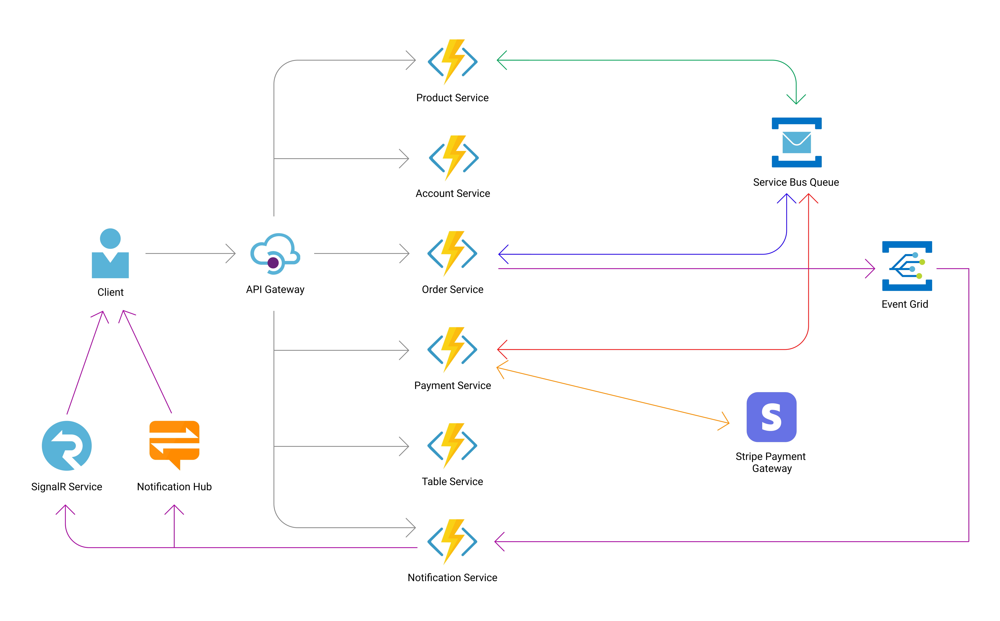

# Eater

Eater is a restaurant food ordering application for contactless dining experience. This repository is the backend for the application, employing event-driven microservices with Clean Architecture using CQRS (Command Query Responsibility Segregation) and Saga design pattern.

### Architecture

### Tech Stack
- Azure API Management for API gateway
- Azure Function on .NET 6 for each microservice
- Azure Cosmos DB for database
- Azure Event Grid and Service Bus for messaging
- Azure Blob Storage for storing files
- Stripe as Payment Gateway

### Libraries
- [MediatR](https://github.com/jbogard/MediatR)
- [FluentValidation](https://fluentvalidation.net/)
- [Mapster](https://github.com/MapsterMapper/Mapster)
- [ImageSharp](https://github.com/SixLabors/ImageSharp)
- [QRCoder](https://github.com/codebude/QRCoder)
- [Stripe.net](https://github.com/stripe/stripe-dotnet)

### TODO
- [x] Account microservice
- [x] Product microservice
- [x] Table microservice
- [x] Payment microservice
- [x] Order microservice
- [x] Notification microservice
- [ ] CI/CD
